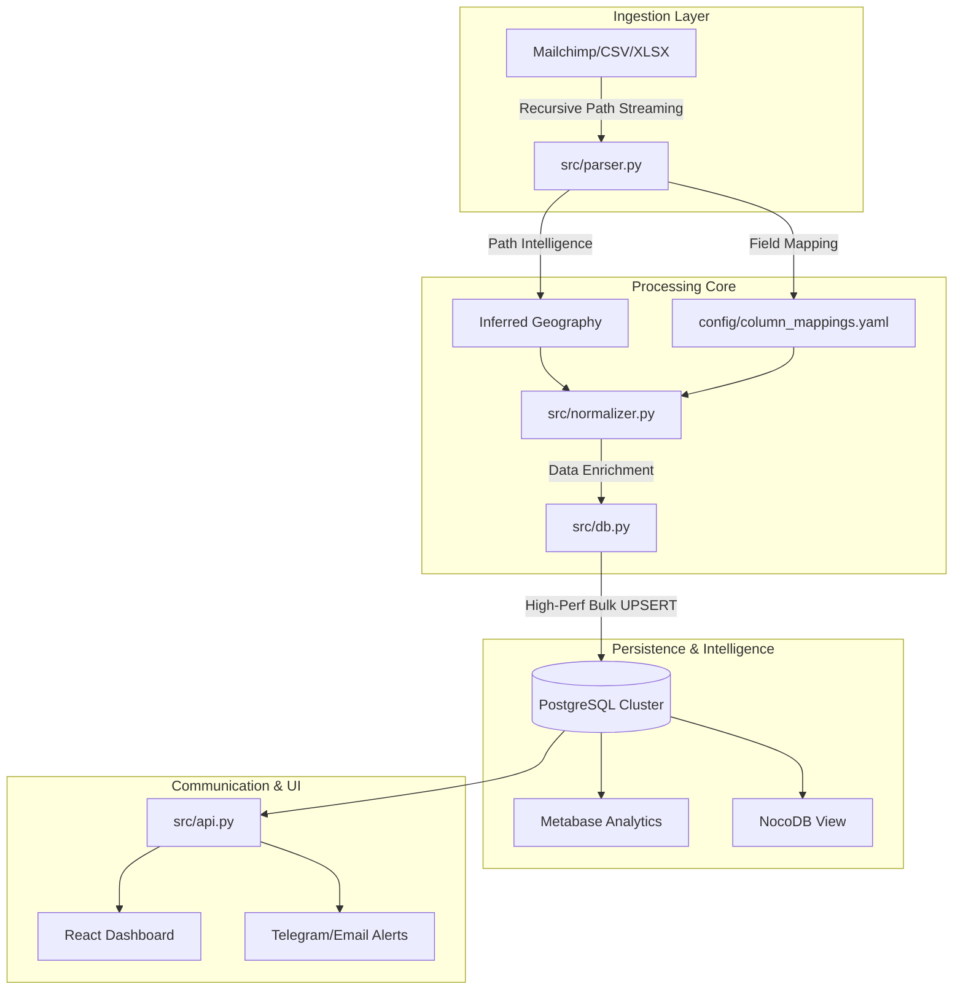

# 🛡️ Lead Intelligence Hub - Official Technical Manual (v1.0.0 PRO)

[](https://www.python.org/)
[](https://fastapi.tiangolo.com/)
[](https://www.postgresql.org/)
[](https://www.docker.com/)

---

## 📖 Executive Summary
The **Lead Intelligence Hub** is a production-grade, high-performance ecosystem designed to solve the challenges of fragmented lead data. It provides an automated pipeline for **ingestion**, **geographic enrichment**, and **real-time analytics**, transforming raw file archives into a centralized, intelligence-driven database with zero manual effort.

---

## 🏗️ Detailed Project Architecture & File System

Below is an exhaustive breakdown of every component in the repository:

```text
leads_importer/
├── alembic/               # Database migrations (Alembic)
├── config/                # Column mappings & source priorities
├── docker/                # Multi-stage Docker definitions
├── frontend/              # Lead Analytics Dashboard (React + Vite)
├── nginx/                 # Reverse Proxy, SSL & Auth config
├── src/                   # Core Engine (FastAPI & Pipeline logic)
│   ├── api.py             # REST API & Metabase embedding
│   ├── cli.py             # Ingestion orchestrator
│   ├── db.py              # PostgreSQL high-perf UPSERT
│   ├── parser.py          # Path-intelligence & File streaming
│   └── run_mass_import.py # Bulk archive entry point
├── docker-compose.yml     # Full-stack service orchestration
└── run.py                 # Multi-service entry point
```

---

## 🗺️ System Logic & Data Lifecycle



---

## ⚡ Core Pipeline Deep-Dive

### 1. Automated Geographic Intelligence (`parser.py`)
Unlike static parsers, this system uses **recursive directory analysis**. It intelligently detects city and country origins by parsing folder names (e.g., `Mailchimp/USA/Chicago/`).
*   **Recursive Detection**: Infers global metadata from the local filesystem path.
*   **Case-Insensitivity**: Handles all naming variations (`USA` vs `usa`).
*   **Source Awareness**: Differentiates between Mailchimp, Organic, and Third-party imports.

### 2. High-Performance Bulk UPSERT (`db.py`)
To handle datasets of **100k+ rows** with zero downtime, the system utilizes raw PostgreSQL `ON CONFLICT (email) DO UPDATE`.
*   **Non-Destructive Merge**: Preserves original lead history while updating contact info.
*   **Incremental Enrichment**: Appends new tags and metadata without overwriting existing intelligence.
*   **Intelligent Batching**: Processes 500 records per transaction for optimal memory management.

### 3. API & Analytics Embedding (`api.py` & `metabase.py`)
The system provides a secure layer for data visualization:
*   **FastAPI Backend**: Provides real-time metrics, status updates, and import logs.
*   **Metabase Signed Embedding**: Uses JWT (JSON Web Tokens) with HS256 encryption to securely serve analytics to the dashboard.

---

## 🔐 Security & Hardening

*   **Reverse Proxy Isolation**: Direct access to Backend/DB/Metabase is blocked. All traffic flows through Nginx.
*   **Basic Authentication**: The entire ecosystem is protected by server-side `.htpasswd`.
*   **Environment Isolation**: No secrets are stored in code. All keys reside in restricted `.env` files.
*   **Database GIN Indexing**: Optimized search capabilities on JSONB/Metadata fields for rapid lead filtering.

---

## 🏁 Deployment & Operations

### Standard Launch
```bash
# Prepare environment
cp .env.example .env

# Orchestrate the entire stack
docker-compose up -d --build
```

### Ingestion Orchestration
To scan and process the entire archive:
```bash
docker exec leads_backend python -m src.run_mass_import
```

---
*Developed by Stanislav Rudyk. Project Lead Intelligence Hub v1.0.0 Production.*
